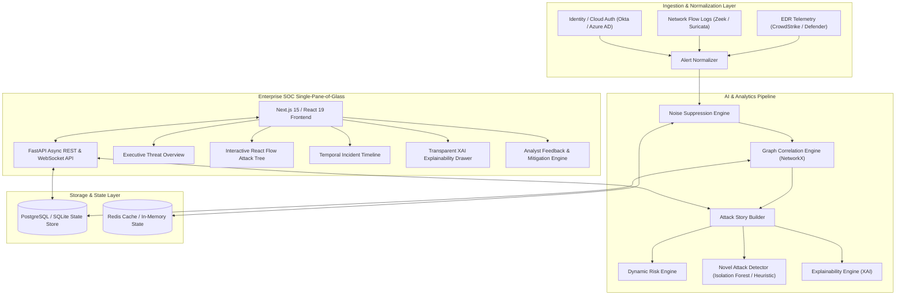
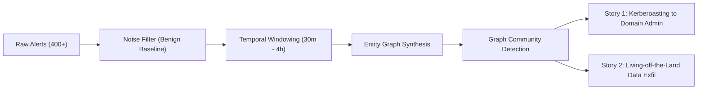
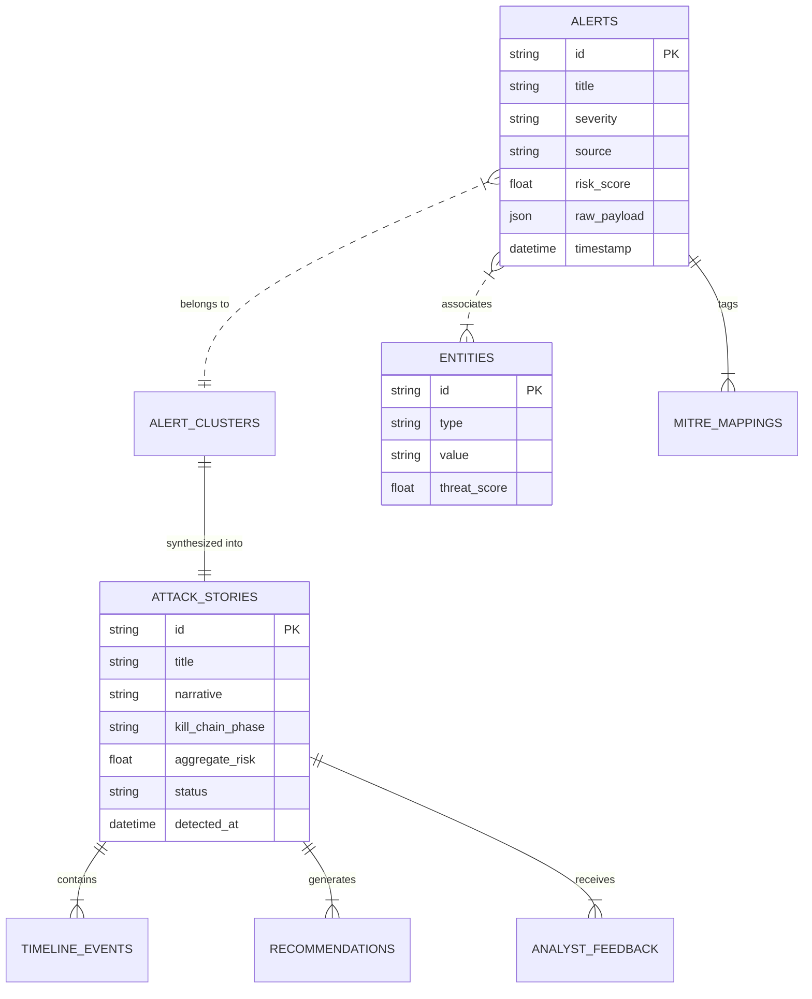

# SentinelAI — System Architecture Blueprint

## 1. High-Level Architecture

SentinelAI follows an event-driven, graph-accelerated microservices architecture designed to ingest high-throughput alerts, perform multi-attribute entity resolution, and synthesize unified attack narratives.

---

## 2. Attack Correlation Pipeline

The correlation engine reduces alert volume by over 95% via graph clustering:

---

## 3. Database Schema Overview

